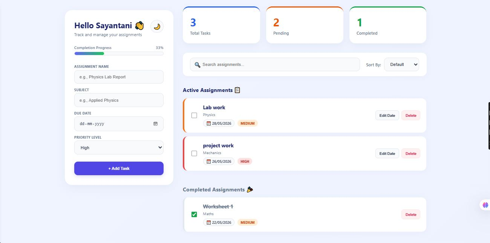
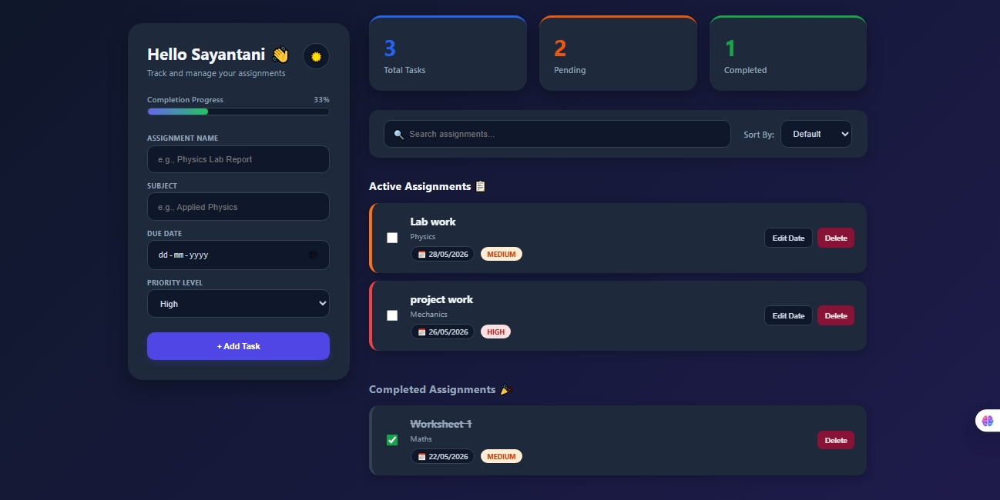

# 📚 Assignment Planner Dashboard

A modern and interactive Assignment Planner Dashboard built using **HTML, CSS, and JavaScript** to help students organize assignments, manage deadlines, and track academic productivity efficiently.

---

## 📸 Project Preview

### Dashboard Interface



### Additional View



---

## ✨ Features

✅ Add assignments easily  

✅ Track due dates  

✅ Priority levels (High / Medium / Low)  

✅ Search assignments instantly  

✅ Sort assignments  

✅ Progress tracking bar  

✅ Dashboard statistics
- Total Tasks
- Pending Tasks
- Completed Tasks

✅ Active & Completed assignment sections  

✅ Dark mode toggle 🌙  

✅ Delete assignments  

✅ Responsive dashboard design  

---

## 🛠 Tech Stack

- HTML5
- CSS3
- JavaScript
- GitHub Pages

---

## 🚀 Live Demo

Visit here:

https://sayantani-aiml.github.io/assignment-planner/

---

## 📂 Project Structure

```text
assignment-planner/

├── index.html

├── style.css

├── script.js

├── preview1.JPG

├── preview2.jpeg

└── README.md
```

---

## 🎯 Learning Outcomes

This project helped strengthen understanding of:

- DOM Manipulation
- JavaScript Functions
- UI / UX Design
- Responsive Layout Design
- GitHub Deployment Workflow
- Frontend Development Concepts
- Dashboard Interface Development

---

## 🔮 Future Improvements

- Local Storage support
- Notification reminders
- Calendar integration
- Export assignments option
- Authentication system

---

## 💡 Project Goal

To create a modern student productivity dashboard that simplifies assignment management and improves task organization.

---

### 👩‍💻 Developer

Built by **Sayantani Das** as a frontend development learning project while exploring modern web development workflows.

⭐ If you like this project, consider starring the repository.